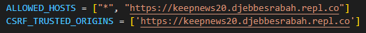

# Keep News 2.0:

[](https://ko-fi.com/K3K8EMH3R)

Keep News 2.0 Is An Automated News Delivery System for Exclusive News And Events That Concern The Russia-Ukraine Conflict.

The website automatically fetches news using a free [third-party API](https://rapidapi.com/contextualwebsearch/api/web-search/) every 1 hour.

## Demo

### Frontend :
Front End Demo [Here](https://keepnews20.djebbesrabah.repl.co/)
### Backend :
Back End Demo [Here](https://keepnews20.djebbesrabah.repl.co/admin/dashboard/)

username: rabahdjebbes <br />
password: 02.02.2002


## Installation

Clone The project to your local machine:

```bash
git clone https://github.com/rabahdj2002/KeepNews2.0.git
```

Use the package manager [pip](https://pip.pypa.io/en/stable/) to install the requirements:

```bash
pip install -r requiremnts.txt
```

## Running

```bash
python manage.py runserver
```

Go to your [127.0.0.1:8000](http://127.0.0.1:8000/) to view your website

## Note
- Many features including sending emails are still under development

- Make sure you use your own domain in settings.py
